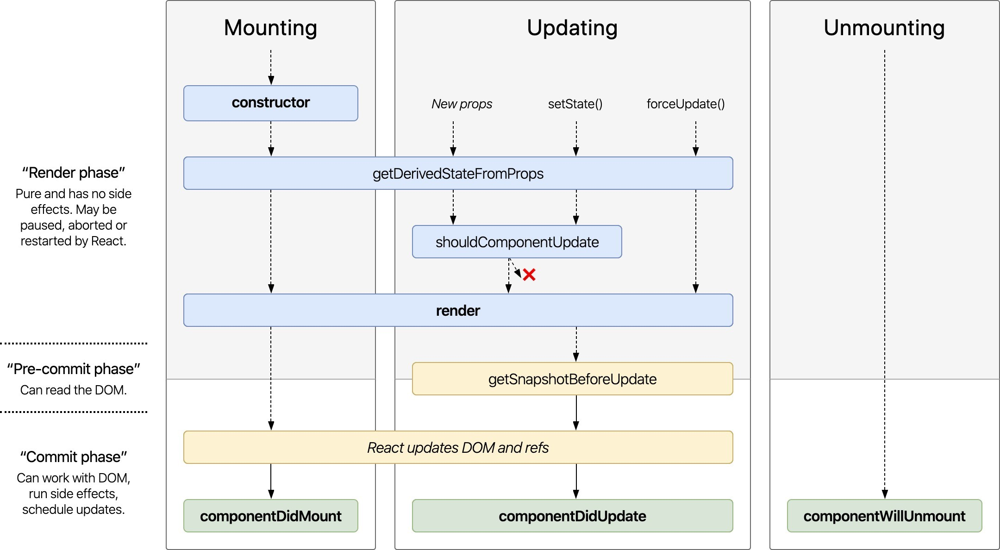
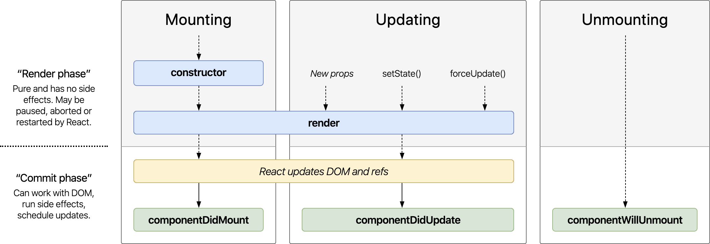
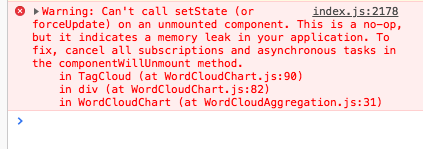

# Learning-ReactJS

## 1. Cách chia component trong ReactJS

### Hai loại components

- **Container**: Smart component

  - Quản lý, xử lý dữ liệu.
  - Không quan tâm render UI như thế nào.
  - Chỉ quan tâm render cái gì.
  - Có thể chứa container con và các components

- **Component**: Dumb component
  - Cho gì render đó.
  - Không biết dữ liệu đến từ đâu.
  - Thường chỉ có props, không có state.
  - Tái sử dụng, với props khác nhau, render khác nhau.

## 2. ReactJS - Props, State và Global State 🤔

### Props

- Không thay đổi được
- Được truyền từ component cha
- Tạo sự đa dạng cho component

```js
function Box(props) {
  return <div style={{ backgroundColor: props.color }}></div>;
}

function App() {
  return (
    <div>
      <Box color="deeppink" />
      <Box color="green" />
    </div>
  );
}
```

### State

- Thay đổi được
- Dùng khi chỉ được sử dụng bởi MỘT component hiện tại
- **Ví dụ**:
  - Dữ liệu từ API chỉ dùng trong component.
  - currentSecond trong count down.
  - ...

### Global State (redux)

- Thay đổi được
- NẾU được dùng bởi NHIỀU component
- **Ví dụ**:
  - Thông tin logged in user.
  - Thông tin của giỏ hàng
  - ...

## 3. ReactJS - Component life cycle

### Life cycle của component trong ReactJS là gì?

- Với component trong **ReactJS**, life cycle gồm 3 giai đoạn:

  - Được tạo ra (**Mounting**)
  - Qua nhiều thay đổi (**Updating**)
  - Và bị huỷ bỏ (**Unmounting**)

- ReactJS life cycle (full version



Link component life cycle diagram: [http://projects.wojtekmaj.pl/react-lifecycle-methods-diagram/](http://projects.wojtekmaj.pl/react-lifecycle-methods-diagram/)

Bảng life cycle rút gọn (nên dùng cái này)



📝 Không sử dụng các life cycle này nữa:

- **componentWillMount()**
- **componentWillReceiveProps()**

❓ Component vs PureComponent

- Nên dùng **PureComponent**
- Vì có shallow comparison trong hàm **shouldComponentUpdate()**
- Link tham khảo: [https://stackoverflow.com/questions/41340697/react-component-vs-reactpurecomponent/53740921](https://stackoverflow.com/questions/41340697/react-component-vs-reactpurecomponent/53740921)

### **constructor()**

- Được phép dùng.
- Nhớ có **super(props)**
- Khai báo state.
- Định nghĩa properties của component.

```js
class App() extends PureComponent {
  constructor(props) {
    super(props);

    this.DEFAULT_MAX_LENGTH = 10;
    this.state = {
      productList: [],
    };
  }
}
```

### **componentDidMount()**

- Được phép dùng.
- Khởi tạo dữ liệu cho component: gọi API, biến đổi dữ liệu, cập nhật state.
- Gửi tracking page view (GA, FacebookPixel, ...)

```js
class HomePage extends PureComponent {
  constructor(props) {
    super(props);

    this.state = {
      loading: true,
      productList: [],
    };
  }

  async componentDidMount() {
    try {
      // Send GA page view tracking
      analytics.page('Home page');

      const productList = await productApi.getAll();
      this.setState({
        productList,
        loading: false,
      });
    } catch (error) {
      console.log('Failed to fetch product list: ', error);
      this.setState({loading: false});
    }
  }

  render() {
    const {loading, productList} = this.state;
    if (loading) return <Loader />;

    return <ProductList productList={productList}>
  }
}
```

### **componentWillUnmount()**

- Được phép dùng.
- Clear timeout hoặc interval nếu có dùng.
- Reset dữ liệu trên redux nếu cần thiết.

```js
class Countdown extends PureComponent {
  constructor(props) {
    super(props);

    this.state = {
      currentSecond: 0,
    };
  }

  componentDidMount() {
    this.timer = setInterval(() => {
      this.setState((prevState) => ({
        currentSecond: prevState.currentSecond - 1,
      }));
    }, 1000);
  }

  componentWillUnmount() {
    if (this.timer) {
      clearInterval(this.timer);
    }
  }

  render() {
    const { currentSecond } = this.state;
    return <p>{currentSecond}</p>;
  }
}
```

### **componentDidUpdate()**

- **Cực kỳ hạn chế** ́dùng
- **ADVANCED** Chỉ dùng nếu muốn handle update component khi click nút back mà trên URL có query params.

Lỗi can't setState() on unmounted component



❓ Lý do:

- Ở trang Home, đang lấy dữ liệu từ API, sau đó update vào state.
- Nhưng ác thay, dữ liệu chưa lấy xong, user qua trang About
- Thế là component Home bị unmount.
- Ngay sau đó, dữ liệu từ API được trả về, và tiếp tục gọi setState()
- Đau lòng thay, component Home có còn đâu mà update.

✅ Giải pháp

- Dùng một flag isComponentMounted để biết trạng thái của component.

```js
class Home extends PureComponent {
  constructor(props) {
    super(props);
    this.isComponentMounted = false;
    this.state = {
      productList: [],
    };
  }

  async componentDidMount() {
    this.isComponentMounted = true;
    try {
      const productList = await productApi.fetchProductList();
      if (this.isComponentMounted) {
        this.setState({ productList });
      }
    } catch (error) {
      console.log("Failed to fetch data:", error);
    }
  }

  componentWillUnmount() {
    this.isComponentMounted = false;
  }

  render() {
    // Render something here ...
  }
}
```

📝 Túm lại, nhớ nè

- Cần refactor lại code nếu có đang dùng
  - **componentWillMount()**
  - **componentWillReceiveProps()**
- Chỉ sử dụng các life cycle sau:
  - **constructor()**
  - **componentDidMount()**
  - **componentWillUnmount()**
- Cực kì hạn chế sử dụng componentDidUpdate()
